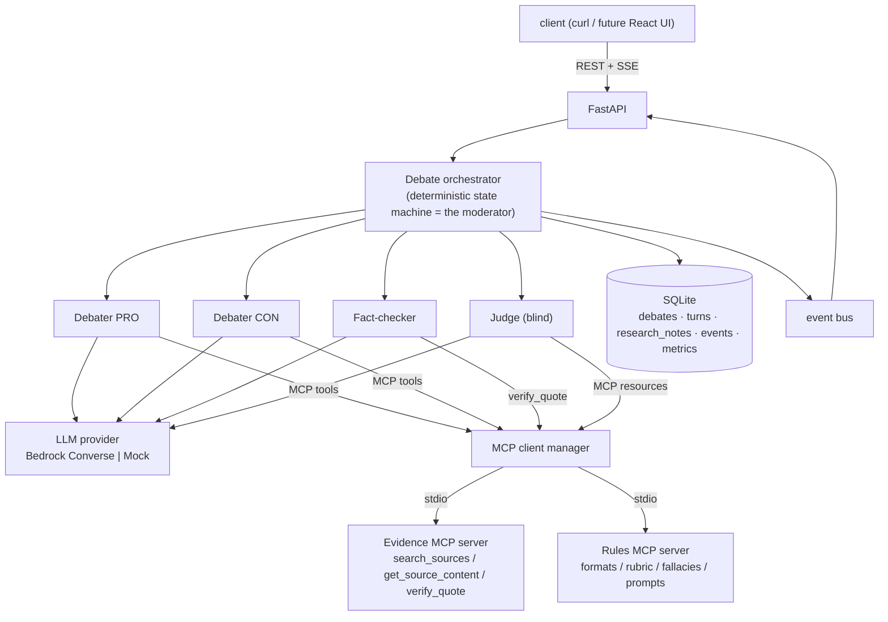

# Agora backend


A multi-agent debate and evaluation platform. Two LLM agents argue a motion through a staged debate and research their evidence over MCP. A fact-checker verifies every citation against the actual sources, and a judge scores the transcript blind against a weighted rubric. Position-swap runs tell you whether a win came from the model or from the side it argued, which turns Agora into a reusable model-comparison environment rather than a chatbot demo.

It runs entirely locally and costs nothing by default, using a deterministic mock provider and offline evidence fixtures. Flip one environment variable and the same pipeline runs real cross-vendor models on AWS Bedrock for about 2 cents per debate.

## Architecture



A debate walks a fixed phase flow: OPENING, then N rebuttal rounds, then CLOSING, VERIFICATION and JUDGING. Turn order and phase transitions are deterministic code, not an LLM moderator. Every step is emitted as a typed event that gets persisted for replay and streamed live over SSE.

## Design decisions (ADRs)

The full reasoning, including the alternatives that lost, lives in [docs/adr/](docs/adr/README.md). The load-bearing ones:

| ADR | Decision |
|---|---|
| [0002](docs/adr/0002-deterministic-state-machine-as-moderator.md) | The moderator is a state machine, not an LLM. Flow is a guarantee, so it lives where guarantees are enforceable. |
| [0003](docs/adr/0003-hard-limits-in-code-not-prompts.md) | Hard limits (rounds, token caps, evidence quotas) are enforced in code, never requested in prompts. |
| [0004](docs/adr/0004-bedrock-converse-api-for-llm-access.md) | Bedrock Converse gives one tool-use shape across vendors, which enables per-role model config and cross-vendor comparison. |
| [0005](docs/adr/0005-hand-rolled-agent-loop-with-mcp-sdk.md) | The agent loop is hand-rolled on the official MCP SDK, because the loop is where quotas, metrics and memory capture live. |
| [0006](docs/adr/0006-two-mcp-servers-tools-vs-resources.md) | Two MCP servers demonstrate both halves of the spec: evidence exposes tools, rules exposes resources and prompts. |
| [0007](docs/adr/0007-debater-memory-research-notebook.md) | Debater memory is a private research notebook captured in plain code. No vector store, on purpose. |
| [0008](docs/adr/0008-blind-judging-and-position-swap.md) | Blind judging, schema-validated rubric verdicts, and position-swap evaluation. |
| [0009](docs/adr/0009-local-first-sqlite-sse-replay-mock-default.md) | Local first: SQLite, SSE with stored-event replay, mock mode as the default. |
| [0010](docs/adr/0010-mock-provider-as-first-class-implementation.md) | The mock provider is a first-class implementation selected by config, not test patching. |

## Quickstart (no AWS, no network, no cost)

```bash
python -m venv .venv && .venv/Scripts/pip install -r requirements-dev.txt   # Windows
uvicorn app.main:app --reload
```

```bash
# create a debate (mock mode is the default)
curl -X POST http://127.0.0.1:8000/debates \
  -H "Content-Type: application/json" \
  -d '{"topic": "Remote work is better than office work"}'

# watch it live over SSE: phases, evidence calls, streamed statements, verdicts
curl http://127.0.0.1:8000/debates/<id>/events

# afterwards: transcript, verdict, and both private research notebooks revealed
curl http://127.0.0.1:8000/debates/<id>
curl http://127.0.0.1:8000/debates/<id>/metrics
```

On PowerShell use `curl.exe`, since bare `curl` aliases to `Invoke-WebRequest`. `Invoke-RestMethod` works too.

## Live mode (AWS Bedrock)

```bash
AGORA_MOCK_MODE=0 uvicorn app.main:app
```

No credentials are stored in this repo. boto3 uses the standard AWS chain (environment variables, `~/.aws/credentials`, or an IAM role). Without credentials live mode fails closed, and mock mode needs none.

Friendly model names map to Bedrock IDs in `app/config.py`. The default lineup is Nova Lite (pro) against Mistral Small (con), with Nova Pro judging and Nova Micro fact-checking. A full debate costs roughly 2 cents.

Costs are guarded three ways. Mock mode is the default. Every debate is size-capped by hard limits. And only the cheap verified lineup can be requested through the API at all, so anything pricier in the registry returns a 422 unless you deliberately expand `AGORA_ALLOWED_MODELS`.

| Env var | Default | Meaning |
|---|---|---|
| `AGORA_MOCK_MODE` | `1` | set `0` to use Bedrock |
| `AGORA_AWS_REGION` | `us-east-1` | Bedrock region |
| `AGORA_ALLOWED_MODELS` | cheap lineup | comma-separated friendly names, or `*` |
| `AGORA_DB_PATH` | `./agora.db` | SQLite location |

## The evaluation layer

Blind judging. The judge sees participant_x and participant_y with a random per-debate assignment, never sides or model names. It must return schema-validated JSON scores for every rubric category. Invalid output gets one retry with the validation error attached, and after that the debate fails rather than accept an unscored verdict.

Mechanical fact-checking. An LLM extracts the cited claims, then `verify_quote` checks each one against the actual source text. Uncited and fabricated citations get flagged and land in the verdict.

Position swap (`POST /evaluations/position-swap`). The same topic runs twice with the debater models exchanging sides. If the same model wins from both sides, that is a model advantage. If the same side wins with either model, the topic or the judge favours that position, and a model ranking built on it would be meaningless.

### Findings from the first live runs (2026-07, 3 debates, about 6 cents)

1. Our own prompt taught the models to fabricate citations. The system prompt included an example id, "(source: 1001)", and both models copied it verbatim as a citation for claims they never researched. The fact-checker caught all 13. The example is gone now and fabricated citations are explicitly warned against.
2. Mistral Small never called a tool, even under prescriptive instructions, while Nova Lite researched on its own. Whether a model actually researches when handed tools turns out to be a leaderboard dimension in itself.
3. Run 3 demonstrated the whole thesis in one debate. Nova Lite researched Wikipedia, cited real sources, and visibly adapted when it hit the code-enforced evidence quota mid-rebuttal. Mistral Small, with an empty research notebook, invented three academic-sounding citations complete with fake quotes. The fact-checker flagged every one as not found, and the blind judge scored evidence quality 7 against 4 and gave Nova the win at 0.7 confidence, citing its consistent use of evidence.
4. The judge had returned identical score vectors in the two early evidence-free runs, which looked like lazy scoring. Once the sides genuinely differed it differentiated cleanly. The order-bias experiment on the roadmap will quantify this properly.
5. Wikimedia rejects generic User-Agents with a 403, so every live evidence call failed silently until the UA carried contact info. The pipeline still behaved correctly: no evidence led to low evidence scores and reasoned draws.
6. Nova leaks its `<thinking>` scratchpad into statements. Transcripts are now cleaned deterministically, because prompts are advisory and hygiene is not.

## API

| Route | Purpose |
|---|---|
| `POST /debates` | create and start a debate (`topic`, optional `format`, `models`, `rebuttal_rounds`) |
| `GET /debates`, `GET /debates/{id}` | list and detail (transcript, verdict, research notebooks) |
| `GET /debates/{id}/events?replay=1&delay=0.05` | SSE, live stream or stored replay |
| `GET /debates/{id}/metrics` | tokens, latency and tool calls per agent |
| `POST /evaluations/position-swap` | run the swapped pair |
| `GET /evaluations`, `GET /evaluations/{id}` | evaluation results with the debates embedded |
| `GET /models`, `GET /formats` | registry, defaults and allowlist, plus debate formats read from the rules MCP server |

## Repo layout

```
app/
├── config.py        hard limits · model registry · cost allowlist
├── api/             REST + SSE routes
├── orchestrator/    state machine · typed events · orchestrator + event bus
├── agents/          providers (Bedrock/Mock) · tool loop · debater · judge · fact-checker
├── mcp_client/      stdio session manager · MCP to Bedrock schema conversion
├── evaluation/      blind relabeling · position swap
└── storage/         SQLite (debates, turns, research_notes, events, metrics)
mcp-servers/
├── evidence/        MCP tools (Wikipedia, with an offline fixture mode for tests)
└── rules/           MCP resources + prompts (formats, rubric, fallacies)
docs/adr/            architecture decision records
tests/               54 tests: unit, MCP-over-stdio integration, full e2e
```

## Testing

```bash
pytest tests -q
```

No network, no AWS, no secrets. The MCP servers run as real subprocesses over stdio with the evidence server in offline fixture mode, and the e2e tests boot the actual app and run complete debates through the HTTP API, including a byte-identical SSE replay check.

## Roadmap

- React frontend: live split-view debate, score radar, notebook reveal, replay gallery
- Order-bias test (judge the same transcript in both orders) and multi-judge panels
- Leaderboard and ELO across stored debates
- Word-overlap reporting or semantic quote verification in the fact-checker
- Human-vs-agent mode
- Terraform module for the AWS deployment, with a replay-only public demo
