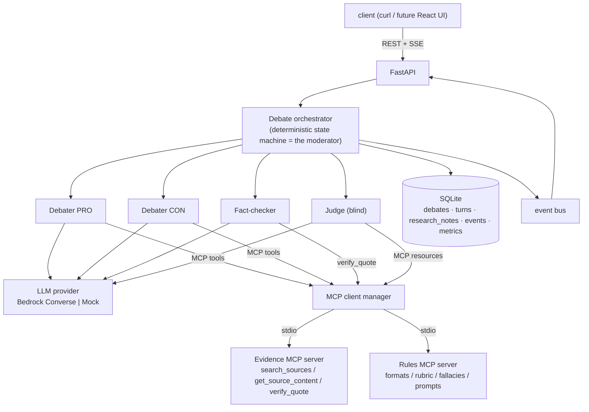

# Agora — backend

A **multi-agent debate and evaluation platform**. Two LLM debater agents argue a motion through a staged debate, researching evidence over **MCP**; a fact-checker mechanically verifies every citation; a judge scores the transcript **blind** against a weighted rubric. Position-swap runs separate genuine model advantage from position bias — making Agora a reusable model-comparison environment, not a chatbot demo.

Runs entirely locally at **$0 by default** (deterministic mock provider + offline evidence fixtures). Flip one environment variable and the same pipeline runs real cross-vendor models on AWS Bedrock for about **$0.02 per debate**.

## Architecture



A debate walks a fixed phase flow — **OPENING → REBUTTAL×N → CLOSING → VERIFICATION → JUDGING** — where turn order and phase transitions are deterministic code, not an LLM moderator. Every step is emitted as a typed event: persisted for byte-identical replay, streamed live over SSE.

## Design decisions (ADRs)

The full reasoning, including rejected alternatives, lives in [docs/adr/](docs/adr/README.md). The load-bearing ones:

| ADR | Decision |
|---|---|
| [0002](docs/adr/0002-deterministic-state-machine-as-moderator.md) | The moderator is a state machine, not an LLM — flow is a guarantee, so it lives where guarantees are enforceable |
| [0003](docs/adr/0003-hard-limits-in-code-not-prompts.md) | Hard limits (rounds, token caps, evidence quotas) are enforced in code, never requested in prompts |
| [0004](docs/adr/0004-bedrock-converse-api-for-llm-access.md) | Bedrock Converse API: one tool-use shape across vendors → per-role model config and cross-vendor leaderboards |
| [0005](docs/adr/0005-hand-rolled-agent-loop-with-mcp-sdk.md) | Hand-rolled agent loop over the official MCP SDK — the loop is where quotas, metrics and memory capture live |
| [0006](docs/adr/0006-two-mcp-servers-tools-vs-resources.md) | Two MCP servers demonstrating both halves of the spec: evidence (tools), rules (resources + prompts) |
| [0007](docs/adr/0007-debater-memory-research-notebook.md) | Debater memory = private research notebooks, captured deterministically; no vector store (right-sizing over cargo-culting) |
| [0008](docs/adr/0008-blind-judging-and-position-swap.md) | Blind judging, schema-validated rubric verdicts, position-swap evaluation |
| [0009](docs/adr/0009-local-first-sqlite-sse-replay-mock-default.md) | Local-first: SQLite, SSE with stored-event replay, mock mode default |
| [0010](docs/adr/0010-mock-provider-as-first-class-implementation.md) | The mock provider is a first-class implementation, not test patching |

## Quickstart (no AWS, no network, $0)

```bash
python -m venv .venv && .venv/Scripts/pip install -r requirements-dev.txt   # Windows
uvicorn app.main:app --reload
```

```bash
# create a debate (mock mode is the default)
curl -X POST http://127.0.0.1:8000/debates \
  -H "Content-Type: application/json" \
  -d '{"topic": "Remote work is better than office work"}'

# watch it live (SSE) — phases, evidence calls, streamed statements, verdicts
curl http://127.0.0.1:8000/debates/<id>/events

# afterwards: transcript, verdict, both private research notebooks revealed
curl http://127.0.0.1:8000/debates/<id>
curl http://127.0.0.1:8000/debates/<id>/metrics
```

PowerShell users: use `curl.exe` (bare `curl` aliases to `Invoke-WebRequest`), or `Invoke-RestMethod`.

## Live mode (AWS Bedrock)

```bash
AGORA_MOCK_MODE=0 uvicorn app.main:app
```

- **Credentials:** none are stored in this repo — boto3 uses the standard AWS chain (env vars, `~/.aws/credentials`, or an IAM role). Without credentials, live mode fails closed; mock mode needs none.
- **Models:** friendly names map to Bedrock IDs in `app/config.py`. Default lineup: Nova Lite (pro) vs Mistral Small (con), Nova Pro judging, Nova Micro fact-checking — **~$0.02 per debate**.
- **Cost guard:** only the cheap lineup is requestable via the API; pricier registry entries return 422 unless deliberately enabled with `AGORA_ALLOWED_MODELS`. Debate size is independently capped by hard limits, and nothing runs unless a debate is explicitly created.

| Env var | Default | Meaning |
|---|---|---|
| `AGORA_MOCK_MODE` | `1` | `0` switches to Bedrock |
| `AGORA_AWS_REGION` | `us-east-1` | Bedrock region |
| `AGORA_ALLOWED_MODELS` | cheap lineup | comma-separated friendly names, or `*` |
| `AGORA_DB_PATH` | `./agora.db` | SQLite location |

## The evaluation layer

- **Blind judging** — the judge sees `participant_x`/`participant_y` (random per-debate assignment), never sides or model names, and must return schema-validated JSON scores per rubric category; invalid output is retried once with the validation error, then the debate fails rather than accept an unscored verdict.
- **Mechanical fact-checking** — an LLM extracts cited claims; `verify_quote` checks them against the actual source text. Uncited and fabricated citations are flagged and land in the verdict.
- **Position swap** (`POST /evaluations/position-swap`) — same topic, debater models exchange sides. Same model wins twice → `model_advantage`. Same *side* wins twice → `position_bias`, and a model ranking from that topic would be meaningless.

### Findings from the first live runs (2026-07, 2 debates, ~4¢)

1. **The prompt taught models to fabricate citations.** The system prompt's example ID ("e.g. (source: 1001)") got copied verbatim by both models as a citation for unresearched claims. Our own fact-checker caught all 13 — the example is gone, and fabricated citations are now explicitly warned against.
2. **Mistral Small never called a tool**, even under prescriptive instructions, while Nova Lite researched on its own. "Does this model actually research when given tools" is itself a leaderboard dimension.
3. **The judge (Nova Pro) returned identical per-side score vectors in both runs** — the kind of degenerate scoring the position-swap and order-bias experiments exist to quantify.
4. Wikimedia 403s generic User-Agents; evidence calls silently failed until the UA carried contact info. The pipeline behaved correctly throughout: no evidence → evidence_quality 2–3/10 → reasoned draws.

## API

| Route | Purpose |
|---|---|
| `POST /debates` | create + start a debate (`topic`, optional `format`, `models`, `rebuttal_rounds`) |
| `GET /debates` / `GET /debates/{id}` | list / detail (transcript, verdict, research notebooks) |
| `GET /debates/{id}/events?replay=1&delay=0.05` | SSE — live stream or stored replay |
| `GET /debates/{id}/metrics` | tokens, latency, tool calls per agent |
| `POST /evaluations/position-swap` | run the swapped pair |
| `GET /evaluations` / `GET /evaluations/{id}` | evaluation results with embedded debates |
| `GET /models` / `GET /formats` | registry, defaults, allowlist; debate formats (read from the rules MCP server) |

## Repo layout

```
app/
├── config.py        hard limits · model registry · cost allowlist
├── api/             REST + SSE routes
├── orchestrator/    state machine · typed events · orchestrator + event bus
├── agents/          providers (Bedrock/Mock) · tool loop · debater · judge · fact-checker
├── mcp_client/      stdio session manager · MCP→Bedrock schema conversion
├── evaluation/      blind relabeling · position swap
└── storage/         SQLite (debates, turns, research_notes, events, metrics)
mcp-servers/
├── evidence/        MCP tools (Wikipedia; offline fixture mode for tests)
└── rules/           MCP resources + prompts (formats, rubric, fallacies)
docs/adr/            architecture decision records
tests/               53 tests — unit, MCP-over-stdio integration, full e2e
```

## Testing

```bash
pytest tests -q
```

No network, no AWS, no secrets: MCP servers run as real subprocesses over stdio with the evidence server in offline fixture mode; the e2e tests boot the actual app and run complete debates through the HTTP API, including deterministic SSE replay.

## Roadmap

- React frontend (live split-view debate, score radar, notebook reveal, replay gallery)
- Order-bias test (judge the same transcript in both orders) and multi-judge panels
- Leaderboard + ELO across stored debates
- Word-overlap reporting / semantic quote verification in the fact-checker
- Human-vs-agent mode
- Terraform module for the AWS deployment (API Gateway → ECS/Lambda → DynamoDB), replay-only public demo
